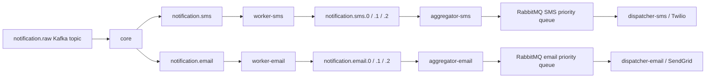

# Notification Service

An asynchronous, multi-channel notification system built with Spring Boot. The service receives raw notification requests, enriches them with user contact details and preferences, routes them to SMS or email, applies priority handling, and dispatches them through Twilio or SendGrid.

## Features

- SMS and email notification routing
- User preference checks for marketing, event, and security messages
- Kafka-based event flow between core services and workers
- RabbitMQ priority queues for final delivery ordering
- Dead-letter queues for failed dispatch handling
- PostgreSQL-backed user contact and preference lookup
- Twilio integration for SMS
- SendGrid integration for email
- Shared `common` module for message contracts and queue configuration

## Architecture



## Modules

| Module | Purpose |
| --- | --- |
| `common` | Shared models, enums, RabbitMQ configuration, and utility classes |
| `core` | Consumes raw notifications, loads user data, and routes to SMS or email |
| `workers/sms` | Applies SMS preference rules and maps message priority to SMS Kafka topics |
| `workers/email` | Applies email preference rules and maps message priority to email Kafka topics |
| `aggregator/sms` | Moves prioritized SMS Kafka messages into RabbitMQ with message priority |
| `aggregator/email` | Moves prioritized email Kafka messages into RabbitMQ with message priority |
| `dispatcher/sms` | Consumes SMS messages from RabbitMQ and sends them through Twilio |
| `dispatcher/email` | Consumes email messages from RabbitMQ and sends them through SendGrid |

## Tech Stack

- Java 21
- Spring Boot 4.0.6
- Maven
- Spring Kafka
- Apache Kafka
- Spring AMQP
- RabbitMQ
- Spring Data JPA
- PostgreSQL
- Lombok
- Twilio SDK
- SendGrid SDK

## Notification Flow

1. A raw notification is published to Kafka topic `notification.raw`.
2. `core` consumes the raw message and checks the requested channel.
3. `core` loads user contact information and notification preferences from PostgreSQL.
4. `core` publishes enriched `MessageDetails` to `notification.sms` or `notification.email`.
5. The relevant worker checks if the user has opted in for the message type.
6. Allowed messages are routed to priority topics:
   - `notification.sms.0`, `notification.sms.1`, `notification.sms.2`
   - `notification.email.0`, `notification.email.1`, `notification.email.2`
7. Aggregators consume the priority topics and publish to RabbitMQ priority queues.
8. Dispatchers consume RabbitMQ messages and send them through Twilio or SendGrid.
9. Failed RabbitMQ messages can move to channel-specific dead-letter queues.

## Priority Mapping

| Business priority | Queue priority |
| --- | --- |
| `HIGHEST` | `2` |
| `HIGH` | `2` |
| `NORMAL` | `1` |
| `LOW` | `1` |
| `LOWEST` | `0` |

RabbitMQ queues are configured with `x-max-priority=2`, so messages are reduced to three delivery levels.

## Prerequisites

Install or run the following services locally:

- JDK 21
- Maven
- PostgreSQL
- Apache Kafka
- RabbitMQ

For real delivery, you also need:

- Twilio account SID, auth token, and sender phone number
- SendGrid API key and verified sender email

## Configuration

Each Spring Boot service imports configuration from `.env` using `spring.config.import`. Create a local `.env` file at the repository root:

```properties
DBUrl=jdbc:postgresql://localhost:5432/NotificationService
DBUsername=your_postgres_username
DBPassword=your_postgres_password
KafkaUrl=localhost:9092

TWILIO_ACCOUNT_SID=your_twilio_account_sid
TWILIO_AUTH_TOKEN=your_twilio_auth_token
TWILIO_PHONE_NUMBER=your_twilio_phone_number

SENDGRID_API_KEY=your_sendgrid_api_key
SENDGRID_FROM_EMAIL=your_verified_sender@example.com
SENDGRID_FROM_NAME=Notification Service
```

Do not commit `.env` to GitHub. Keep real credentials local or store them in your deployment secret manager.

## Database Tables

The `core` service expects user contact and preference data in PostgreSQL.

```sql
CREATE TABLE user_contact_info (
    user_id BIGINT PRIMARY KEY,
    email VARCHAR(255),
    phone_number VARCHAR(50),
    timezone VARCHAR(100),
    language VARCHAR(50)
);

CREATE TABLE user_preferences (
    user_id BIGINT PRIMARY KEY,
    allow_marketing_email BOOLEAN,
    allow_marketing_sms BOOLEAN,
    allow_event_email BOOLEAN,
    allow_event_sms BOOLEAN,
    allow_security_email BOOLEAN,
    allow_security_sms BOOLEAN
);
```

## Build

From the repository root:

```bash
mvn clean install
```

## Run Locally

Start PostgreSQL, Kafka, and RabbitMQ first. Then run the services in separate terminals:

```bash
mvn -pl core -am spring-boot:run
mvn -pl workers/sms -am spring-boot:run
mvn -pl workers/email -am spring-boot:run
mvn -pl aggregator/sms -am spring-boot:run
mvn -pl aggregator/email -am spring-boot:run
mvn -pl dispatcher/sms -am spring-boot:run
mvn -pl dispatcher/email -am spring-boot:run
```

If you only want to test one channel, run `core`, the matching worker, matching aggregator, and matching dispatcher.

## Example Kafka Message

Publish a raw message to `notification.raw`:

```json
{
  "userId": 1,
  "event": {
    "eventName": "login-alert",
    "origin": "auth-service",
    "channel": "SMS",
    "backupChannel": "EMAIL"
  },
  "messageType": "SECURITY",
  "priority": "HIGHEST",
  "messageText": "A new login was detected on your account.",
  "messageSubject": "Security Alert"
}
```

## RabbitMQ Queues

| Queue | Purpose |
| --- | --- |
| `notification.sms.priority.queue` | Prioritized SMS dispatch |
| `notification.sms.dlq` | SMS dead-letter queue |
| `notification.email.priority.queue` | Prioritized email dispatch |
| `notification.email.dlq` | Email dead-letter queue |

## Notes

- Missing user preference values are treated as `false`, so notifications are skipped unless the user has opted in.
- `backupChannel` is present in the event model but is not currently used for fallback routing.
- Dispatcher retry is configured with three attempts and exponential backoff.
- The project is structured as independent Spring Boot applications that share contracts through the `common` module.
